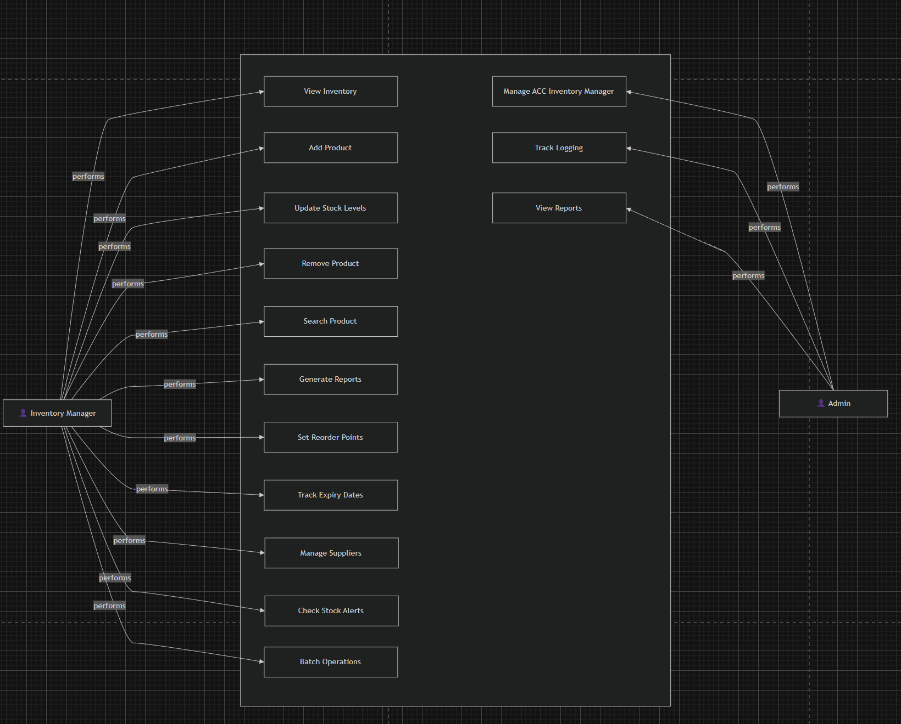
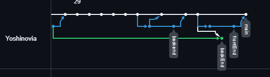

<h1>PROJECT GO PAK ZAINUL</h1>
<div align="center">

  
</div>
# PROJECT GO PAK ZAINUL

## Prerequisites

- Go installed
- Node.js and npm installed
- MySQL / MariaDB installed

## 1. Database setup

1. Create a database named `db_invent`.
2. Import `db_invent.sql` into MySQL.
   - If you only have `db_invent.example`, copy it to `db_invent.sql` first.
   - Import using phpMyAdmin or MySQL CLI.

## 2. Backend setup

1. Go to the backend folder:
   ```bash
   cd backend
   ```
2. Create a `.env` file in `backend/` with these values:
   ```env
   DB_USER=root
   DB_PASS=
   DB_HOST=127.0.0.1
   DB_PORT=3306
   DB_NAME=db_invent
   SERVER_PORT=8080
   ```
3. Run the backend:
   ```bash
   go run .
   ```

## 3. Frontend setup

1. Go to the frontend folder:
   ```bash
   cd frontend
   ```
2. Install dependencies:
   ```bash
   npm install
   npm install lucide-react
   ```
3. Run the frontend:
   ```bash
   npm run dev
   ```

## 4. Open the app

- Frontend: `http://localhost:3000`
- Backend API: `http://localhost:8080`

## 5. Default credentials

- Admin: `admin@example.com`
- Password: `testingajah123`

## Notes

- `backend/.env` should not be committed.
- If your MySQL credentials are different, update `backend/.env`.
- If you want, create `backend/.env.example` as a template file for others.


## Contribute
<a href="https://github.com/Yoshinovia/pra-pkl/graphs/contributors">
  
</a>

